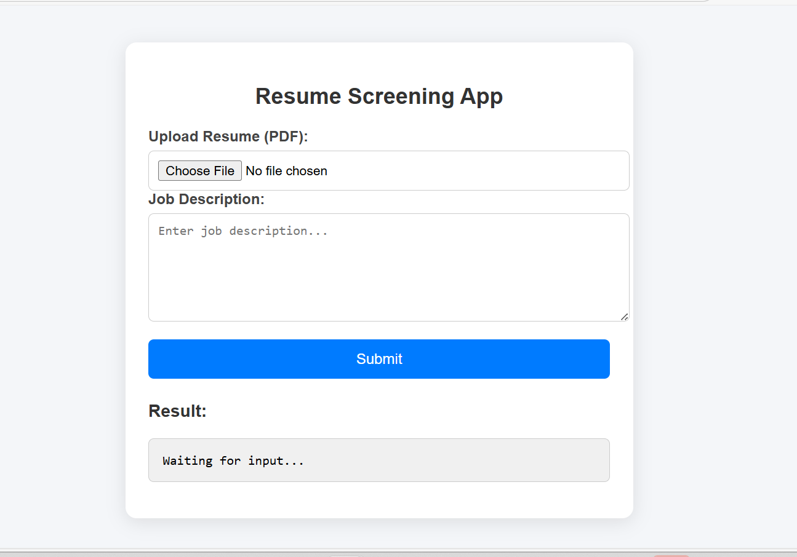

### 📄 Resume Screening API
A machine‑learning powered backend API that analyzes resumes and ranks them based on similarity to a job description. Built with FastAPI, Python, and NLP techniques, this project demonstrates practical ML engineering and API development.

### ⭐ Features

📄 Upload Resume (PDF) — Extracts text from PDF files

🧠 NLP‑based Similarity Matching — Compares resumes with job descriptions

📊 Ranking System — Returns resumes sorted by relevance

⚡ FastAPI Backend — Auto‑generated Swagger UI at /docs

🧹 Clean Modular Code — Organized into main.py, utils.py, and model files

### 🧠 Tech Stack

### Backend API	          - FastAPI

### Machine Learning	    - scikit‑learn (TF‑IDF / CountVectorizer)

### PDF Processing        - PyPDF2 / pdfplumber

### Language	            - Python

### Server	              - Uvicorn

### 📂 Project Structure
```
resume-screening-api/
│
├── app/
│   ├── __init__.py
│   ├── main.py          # FastAPI application
│   └── utils.py         # PDF extraction, preprocessing, similarity logic
│
├── model/               # Saved ML model(s)
│
├── save_model.py        # Script to train and save vectorizer/model
├── requirements.txt     # Dependencies
├── README.md
└── .gitignore
```

### 🚀 How to Run the Project

### 1. Clone the repository
   
git clone https://github.com/Yashaswini944/resume-screening-api.git
cd resume-screening-api

### 2. Create and activate a virtual environment

python -m venv venv
venv\Scripts\activate   # Windows

### 3. Install dependencies

pip install -r requirements.txt

### 4. Start the FastAPI server

uvicorn app.main:app --reload

### 5. Open API documentation
http://127.0.0.1:8000/docs

### 🔍 How It Works (ML Pipeline)

PDF Resume
     ↓
Text Extraction (utils.py)
     ↓
TF‑IDF Vectorizer (model/)
     ↓
Cosine Similarity Calculation
     ↓
Relevance Score
     ↓
Ranked Resume Output (JSON)

### 🎯 Purpose of This Project

This project demonstrates:

Practical NLP skills

Building and deploying ML models

FastAPI backend development

Handling file uploads

Designing production‑ready ML workflows

### 🚀 Live Demo & API Links

### Backend (FastAPI) – Live on Render
https://resume-screening-api-47nw.onrender.com

### FastAPI Interactive Docs
https://resume-screening-api-47nw.onrender.com/docs

🖼️ Frontend Screenshots
### Home Page



